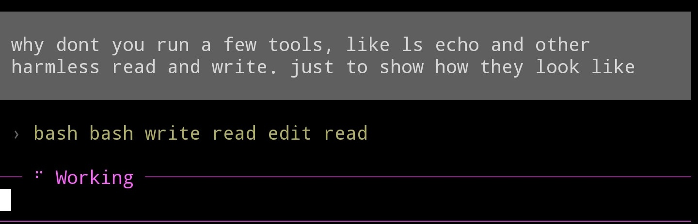

# pi-tiny-tools

A small [Pi](https://github.com/earendil-works/pi-mono) extension that shows tool calls, thinking, and extension messages as colored names instead of full blocks.



Your messages, assistant replies, and assistant errors stay visible as usual. Scrollback keeps the full current branch, including messages from before compaction, even after reloading the session.

Thinking, tools, skills, custom messages and entries, `!` and `!!` shell commands, compactions, and branch summaries shrink to names. Their full content is still available in `/trace`. Billing notices are hidden.

Names wrap onto indented lines when needed. Thinking keeps Pi's usual thinking color.

Run `/trace` or press `Alt+T`, `Ctrl+O` or `Ctrl+T` to step through those items full screen, along with your messages and assistant replies for context. The first item is the current system prompt. Each one is drawn the way Pi draws it expanded: commands with their output, edit diffs, highlighted file contents, extension messages, and thinking in its usual style. Each title shows when the item happened, with the date if it wasn't today, and the model behind thinking and replies. Tool calls take the time of the reply that made them. The inspector starts at the newest item and follows new items and streaming output. `Ctrl+O` and `Ctrl+T` replace Pi's expand toggles, which would change nothing here.

- `←` / `→`, or `h` / `l`: previous / next item
- `H` / `L`: first / last item
- `↑` / `↓`, or `k` / `j`: scroll the current item by a line
- `PageUp` / `PageDown`, `Ctrl+U` / `Ctrl+D`, or the mouse wheel: scroll the current item further
- `g` / `G`: top / bottom of the current item
- `Esc`, `Alt+T`, `Ctrl+O` or `Ctrl+T`: close

The inspector shows what Pi kept. If a tool truncated its output, you'll see the stored result and its truncation notice, not the discarded output.

## Install

```bash
pi install git:github.com/spoj/pi-tiny-tools@v0.1.0
```

Run a local checkout:

```bash
pi -e .
```

## How it works

The extension patches Pi's transcript rendering for built-in, extension, and MCP tools, only for the interactive TUI session; in-process sessions such as workflow subagents are left untouched. It rebuilds the displayed transcript from the full branch rather than the compacted model context. Custom messages use their `customType` as the colored name, including after session reload. The inspector draws the transcript's own hidden components, so extension renderers apply there too. In fullscreen mode, clicking the compact transcript doesn't expand hidden items or thinking.

It relies on Pi's private component state, so Pi updates may break it.

This only changes what you see. Tool results and custom-message content sent to the model are unchanged.

## Credit

Inspired by [Traceline](https://github.com/tmustier/pine-of-glass/tree/main/extensions/pi-traceline) by [tmustier](https://github.com/tmustier), which introduced compact one-line tool traces and synchronized thinking/tool expansion for Pi.
